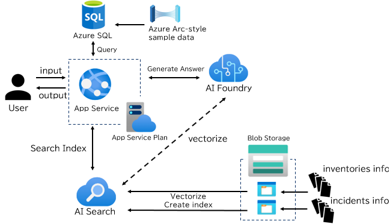

# Infra Support Copilot

This project is an Azure-based Retrieval-Augmented Generation (RAG) web application that answers infrastructure questions about servers, incidents, and ownership. It combines Azure OpenAI Service (GPT + Embeddings), Azure AI Search (multiple indexes), Azure Blob Storage, Azure SQL (Azure Arc inventory), and the Log Analytics API. The app is deployed to Azure App Service using the Azure Developer CLI (`azd`) and Bicep IaC.



## Important

We strongly advise users of this demo not to use this code in their production environments without implementing or enabling additional well-architected (e.g., security, resiliency) features. See the [Azure Well-Architected Framework guidance](https://learn.microsoft.com/azure/well-architected/what-is-well-architected-framework) for tips and consult the [Azure OpenAI Landing Zone reference architecture](https://techcommunity.microsoft.com/blog/azurearchitectureblog/azure-openai-landing-zone-reference-architecture/3882102) for additional best practices.

## Key Features
* Multiple Azure AI Search indexes (inventories, incidents) unified at query time
* Parameterized system prompt engineered for infra Q&A and typo-tolerant normalization
* One-command infra provision via `azd up` (Azure OpenAI, Search, Storage, App Service, Log Analytics)
* Managed Identity-based auth (no API keys in code)
* Scripted data ingest for Blob/Search and Arc data into Azure SQL

## Architecture Overview

Component | Purpose
----------|--------
App Service (Linux, Python) | Hosts FastAPI / Uvicorn app
Azure OpenAI Service (GPT + Embeddings) | Text generation & embedding vectorization
Azure AI Search | Hybrid/semantic retrieval across multiple indexes
Storage Account (Blob) | Source documents (inventories / incidents / Arc)
Azure SQL Database | Azure Arc VM/NIC/installed software ingestion for SQL-based Q&A
Log Analytics Workspace | Centralized diagnostics & logs
Managed Identities | Secure inter-service auth (no secrets)

## Repository Structure
```
.
├── app/          # FastAPI application (entry: app/main.py)
├── infra/        # Bicep IaC (main.bicep provisions Azure OpenAI, Search, SQL, Storage, App Service, Log Analytics)
├── scripts/      # Data & index bootstrap, Arc→SQL ingest, env setup
├── docs/         # Sample data sources
│   ├── incidents/  # Incident markdown sample data
│   └── arc/        # Azure Arc sample data
├── requirements.txt
├── azure.yaml     # azd project definition
└── README.md
```

## Prerequisites
* An Azure subscription with **Owner** role, or **Contributor** + **User Access Administrator** roles (needed for resource provisioning and Managed Identity role assignments)
* Python 3.11+ (App Service uses 3.12; local 3.11/3.12 are fine)
* Azure CLI (`az`) and a signed-in subscription
* Latest Azure Developer CLI (`azd`)
* Git
* ODBC Driver 18 for SQL Server
* [SQL Server PowerShell module](https://learn.microsoft.com/en-us/powershell/sql-server/download-sql-server-ps-module?view=sqlserver-ps)
* [Microsoft Visual C++ Redistributable](https://learn.microsoft.com/en-us/cpp/windows/latest-supported-vc-redist?view=msvc-170)

Dev Container (optional):
* [.devcontainer/devcontainer.json](.devcontainer/devcontainer.json) includes Azure CLI and `azd` features

## Quick Start (Local)
```pwsh
# 1. Clone
git clone https://github.com/Azure-Samples/infra-support-copilot && cd infra-support-copilot

# 2. Python venv
python -m venv .venv
./.venv/Scripts/Activate.ps1   # Windows
# source .venv/bin/activate    # Linux/Mac

# 3. Install deps
pip install -r requirements.txt

# 4. (First time) Provision Azure infra (creates OpenAI/Search/Storage/SQL/App Service)
az login
azd auth login
azd up   # or: azd provision (infra) + azd deploy (code)

# 5. Run locally
uvicorn app.main:app --reload
```

Local URL: http://127.0.0.1:8000

## Quick Start (Manual deployment to Azure)
Important: Ensure the target Azure resource group exists before running `azd up` or `azd provision`. `azd` validates the deployment against the configured resource group and will fail if it doesn't exist (see error in the issue report). Create the resource group with the Azure CLI before provisioning:

```pwsh
az group create -n <resource-group-name> -l <location>
```

Alternatively, set `AZURE_RESOURCE_GROUP` (for local env or CI environment secrets) to the name of an existing resource group. If you prefer `azd` to create resources automatically, ensure your `azure.yaml`/environment configuration does not point to a pre-existing group.

Initial full provision + deploy:
```pwsh
azd auth login
azd up
```

Subsequent code-only deployments:
```pwsh
azd deploy
```

Infra changes only:
```pwsh
azd provision
```

Multiple environments:
```pwsh
azd env new stg
azd up
```

Inspect environment values:
```pwsh
azd env get-values
```

Logs (App Service via Log Analytics): Use the Portal or `az monitor log-analytics query` (workspace defined in Bicep).
> [!NOTE]
> It is possible that it takes about 30 minutes to gather data in Log Analytics.

## Quick Start (GitHub Environments & Multi-subscription CI/CD)

This repository includes a GitHub Actions workflow that can deploy the same `azd` project to multiple Azure subscriptions in parallel by using a matrix of GitHub Environments. To use it safely and predictably, create one GitHub Environment per target subscription and set subscription-scoped secrets/variables into those environments.

Recommended setup:

1. In the repo settings, go to Settings → Environments and create an environment for each target subscription (for example: `rukasakurai-env`, `<github-username>-env`).
2. For each environment, add the following secrets/variables (Repository Settings → Environments → <env>):
  - AZURE_CLIENT_ID (service principal client ID)
  - AZURE_TENANT_ID (tenant ID)
  - AZURE_SUBSCRIPTION_ID (target subscription ID)
   - AZURE_RESOURCE_GROUP (resource group name to deploy into)
   - AZURE_ENV_NAME (azd environment name, e.g. `rukasakurai-env`)
   - AZURE_LOCATION (region, e.g. `japaneast`)

Notes:
- Environment-scoped secrets are available only to workflow runs that specify `environment: <env>`; the CI workflow is configured to use `environment: ${{ matrix.env }}` so each matrix job automatically uses the matching environment's secrets.
- To change which environments the workflow deploys to, edit `.github/workflows/cicd.yml` and update the `matrix.env` array.
- The workflow runs with `strategy.fail-fast: false` so deployments to different subscriptions run independently; failures in one environment don't cancel others.

Example: the workflow currently contains a simple matrix:
```yaml
strategy:
  fail-fast: false
  matrix:
    env: [rukasakurai-env, <github-username>-env]
environment: ${{ matrix.env }}
```

This makes it easy to add more environments (rows) for handover, staging, or multi-tenant deployments. Ensure each GitHub Environment has the correct secrets for its target subscription before running the workflow.

## Sample Data
Sample data is stored under the `/docs` directory. `/scripts` contains scripts for inserting the sample data, which are executed automatically by `azd up` / `azd provision`. The following are steps for manually running the scripts

### Data & Index Bootstrapping

Blob upload + Search index creation:
```pwsh
python scripts/upload_data_to_blob_storage.py
python scripts/create_index.py
```

Details:
* [scripts/upload_data_to_blob_storage.py](scripts/upload_data_to_blob_storage.py) uploads:
  * inventories: [docs/Sample_Server_Inventories.json](docs/Sample_Server_Inventories.json)
  * incidents: docs/incidents/*.md (excludes inc_format.md)
* [scripts/create_index.py](scripts/create_index.py) creates/updates Azure AI Search indexes (idempotent).

### Azure Arc Data → Azure SQL

Ingest Azure Arc inventory into Azure SQL for SQL-based queries:
```pwsh
python scripts/upload_arc_data_to_azure_sql.py
```

Tables created (if missing):
* dbo.virtual_machines (with indexes)
* dbo.network_interfaces (with indexes)
* dbo.installed_software (with indexes)

The app can generate safe, read-only SQL for these tables via [`app.services.sql_query_service.SQLQueryService`](app/services/sql_query_service.py).

All-in-one helper:
```pwsh
# Exports azd env → .env, uploads blob data, creates indexes, uploads SQL data
pwsh -NoProfile -ExecutionPolicy Bypass -File .\scripts\set_up_environment.ps1 -ForceSqlcmd
```

## Customizing the System Prompt

Edit `systemPrompt` in [infra/main.bicep](infra/main.bicep) then:
```pwsh
azd provision
azd deploy   # optional
```
Or override at runtime (Portal → App Service → Configuration → Application settings → `SYSTEM_PROMPT`) and restart.

## Troubleshooting
Issue | Action
------|-------
Auth errors to OpenAI | Verify role assignments (may need a few minutes) and restart
Missing env var | Confirm App Service Configuration or redeploy
Index not found | Re-run `scripts/create_index.py` and verify index names
Slow first response | Cold start/model warm-up; send a warm-up query post-deploy

Tail app logs:
```pwsh
az webapp log tail -n <appServiceName> -g <resourceGroup>
```

## Cleanup
Remove all provisioned resources:
```pwsh
azd down
```
Or delete the resource group in the Azure Portal.
